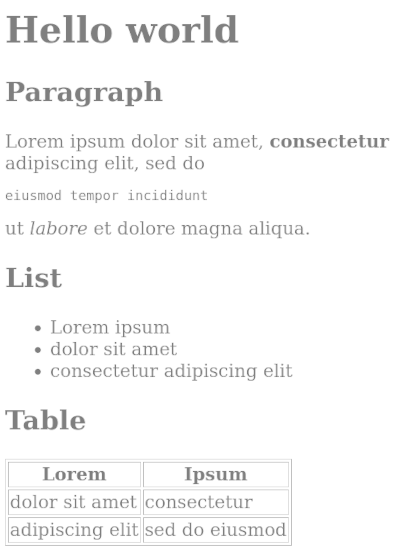

# vertigo-cmark

Converts CommonMark string into rendered vertigo DomElement.

```toml
vertigo-cmark = { git = "https://github.com/vertigo-web/vertigo-cmark" }
```

## Example

```rust
use vertigo::{start_app, DomElement, dom};

const CONTENT: &str = r#"
# Hello world

## Paragraph

Lorem ipsum dolor sit amet, __consectetur__ adipiscing elit, sed do
```eiusmod tempor incididunt```
ut *labore* et dolore magna aliqua.

## List

* Lorem ipsum
* dolor sit amet
* consectetur adipiscing elit

## Table

| Lorem           | Ipsum          |
| --------------- | -------------- |
| dolor sit amet  | consectetur    |
| adipiscing elit | sed do eiusmod |
"#;

fn app() -> DomElement {
    let content = vertigo_cmark::to_vertigo(CONTENT);
    dom! {
        <div>{ content }</div>
    }
}

#[no_mangle]
pub fn start_application() {
    start_app(app);
}
```



## Features

- [x] Regular, bod, italic, strike-through text
- [x] Headings
- [x] Paragraphs
- [x] Tables
- [x] Blockquotes
- [x] Codeblocks
- [x] Lists (numbers, bullets)
- [x] Rules
- [x] Task list markers
- [ ] Html
- [ ] Footnotes
- [ ] Soft/hard breaks
- [ ] Links
- [ ] Images
