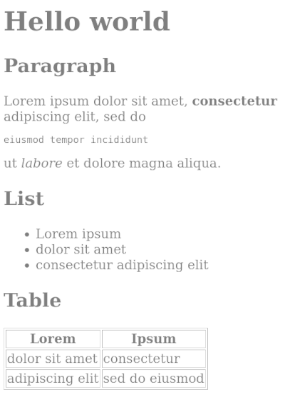

# vertigo-cmark

Converts CommonMark string into rendered vertigo DomElement.

[](https://crates.io/crates/vertigo-cmark)
[](https://docs.rs/vertigo-cmark)

[](https://deps.rs/crate/vertigo-cmark/0.1.0)
[](https://github.com/vertigo-web/vertigo-cmark/actions/workflows/pipeline.yaml)
[](https://crates.io/crates/vertigo-cmark)

See [Changelog](https://github.com/vertigo-web/vertigo-cmark/blob/master/CHANGES.md) for recent features.

## Example

Dependencies:

```toml
vertigo = "0.8"
vertigo-cmark = "0.1"
```

```rust
use vertigo::{start_app, DomElement, dom};

const CONTENT: &str = r#"
# Hello world

## Paragraph

Lorem ipsum dolor sit amet, __consectetur__ adipiscing elit, sed do
```eiusmod tempor incididunt```
ut *labore* et dolore magna aliqua.

## List

* Lorem ipsum
* dolor sit amet
* consectetur adipiscing elit

## Table

| Lorem           | Ipsum          |
| --------------- | -------------- |
| dolor sit amet  | consectetur    |
| adipiscing elit | sed do eiusmod |
"#;

fn app() -> DomElement {
    let content = vertigo_cmark::to_vertigo(CONTENT);
    dom! {
        <div>{ content }</div>
    }
}

#[no_mangle]
pub fn start_application() {
    start_app(app);
}
```



## Features

- [x] Regular, bod, italic, strike-through text
- [x] Headings
- [x] Paragraphs
- [x] Tables
- [x] Blockquotes
- [x] Codeblocks
- [x] Code highlighting (with `syntect` feature)
- [x] Lists (numbers, bullets)
- [x] Rules
- [x] Task list markers
- [x] Footnotes
- [x] Soft/hard breaks
- [x] Links
- [x] Images
- [x] Html (with `html` feature)
