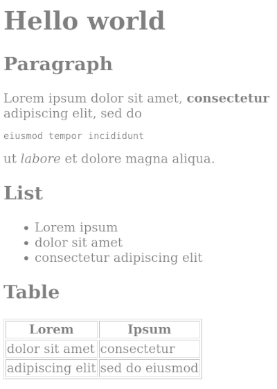

# vertigo-cmark

Converts CommonMark string into rendered vertigo DomElement.

[](https://crates.io/crates/vertigo-cmark)
[](https://docs.rs/vertigo-cmark)

[](https://deps.rs/crate/vertigo-cmark/0.1.3)
[](https://github.com/vertigo-web/vertigo-cmark/actions/workflows/pipeline.yaml)
[](https://crates.io/crates/vertigo-cmark)

See [Changelog](https://github.com/vertigo-web/vertigo-cmark/blob/master/CHANGES.md) for recent features.

## Example

Dependencies:

```toml
vertigo = "0.12"
vertigo-cmark = "0.1"
```

```rust
use vertigo::{start_app, DomElement, dom};

const CONTENT: &str = r#"
# Hello world

## Paragraph

Lorem ipsum dolor sit amet, __consectetur__ adipiscing elit, sed do
```eiusmod tempor incididunt```
ut *labore* et dolore magna aliqua.

## List

* Lorem ipsum
* dolor sit amet
* consectetur adipiscing elit

## Table

| Lorem           | Ipsum          |
| --------------- | -------------- |
| dolor sit amet  | consectetur    |
| adipiscing elit | sed do eiusmod |
"#;

fn app() -> DomElement {
    let content = vertigo_cmark::to_vertigo(CONTENT);
    dom! {
        <div>{ content }</div>
    }
}

#[no_mangle]
pub fn start_application() {
    start_app(app);
}
```



## Features

- [x] Regular, bod, italic, strike-through text
- [x] Headings
- [x] Paragraphs
- [x] Tables
- [x] Blockquotes
- [x] Codeblocks
- [x] Code highlighting (with `syntect` feature)
- [x] Lists (numbers, bullets)
- [x] Rules
- [x] Task list markers
- [x] Footnotes
- [x] Soft/hard breaks
- [x] Links
- [x] Images
- [x] Html (with `html` feature), sanitized by default

## Security

Markdown can carry raw HTML and links to any address, and vertigo-cmark builds
DOM from them directly — there is no HTML string to clean afterwards. So by
default everything goes through `SafeHtml`: elements and attributes from
`ammonia`'s default whitelist and links and images only with safe schemes.
Scripts, styles, event handlers, frames, forms and `javascript:` addresses
don't get into the page, so rendering text from users is safe.

For content you control, `TrustedHtml` renders everything as written. Anything
in between is an own `HtmlPolicy` — usually delegating to `SafeHtml` all but
a few elements:

```rust
use std::borrow::Cow;
use vertigo_cmark::{
    CMarkStyle, ElementAction, HtmlPolicy, SafeHtml, events_to_vertigo,
    pulldown_cmark::Parser,
};

/// Safe HTML plus YouTube players.
struct WithVideos;

impl HtmlPolicy for WithVideos {
    fn element(&self, name: &str) -> ElementAction {
        match name {
            "iframe" => ElementAction::Keep,
            name => SafeHtml.element(name),
        }
    }

    fn attribute<'v>(
        &self,
        element: &str,
        name: &str,
        value: &'v str,
    ) -> Option<Cow<'v, str>> {
        match (element, name) {
            ("iframe", "src") => value
                .starts_with("https://www.youtube.com/embed/")
                .then_some(Cow::Borrowed(value)),
            _ => SafeHtml.attribute(element, name, value),
        }
    }

    fn destination<'u>(
        &self,
        url: &'u str,
        image: bool,
    ) -> Option<Cow<'u, str>> {
        SafeHtml.destination(url, image)
    }
}

let content = events_to_vertigo(
    Parser::new(CONTENT),
    CMarkStyle::default(),
    &WithVideos,
);
```
